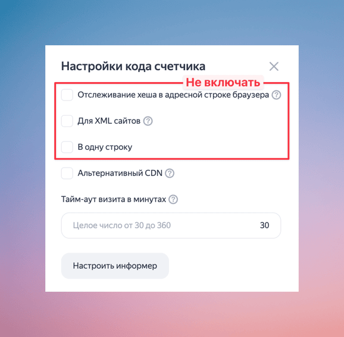
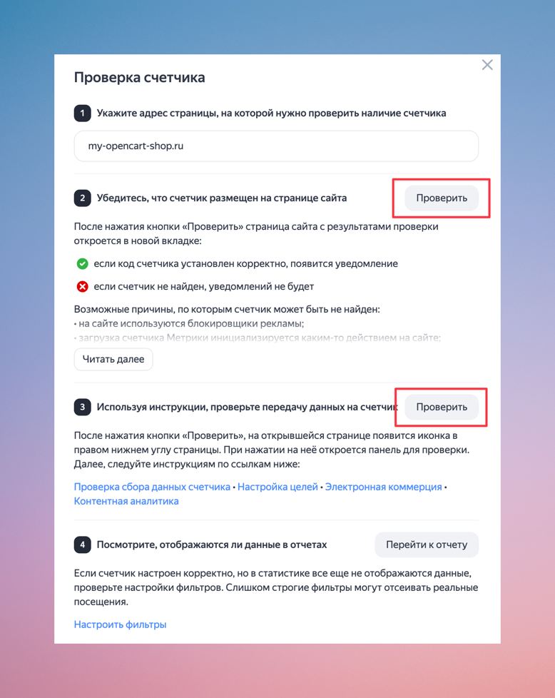
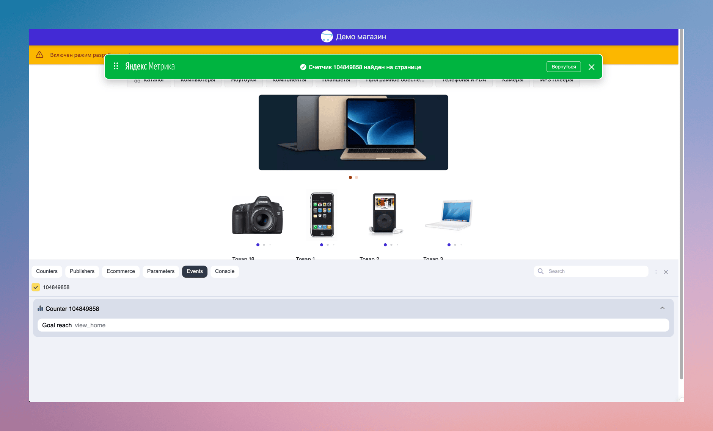

Особое внимание в TeleCart уделено сбору метрик и аналитике пользовательского поведения. Модуль интегрирован с **Яндекс.Метрикой**. 
Для корректной работы метрики необходимо правильно настроить TeleCart и Яндекс.Метрику.

Все события Яндекс.Метрики (включая хиты и цели) привязаны к уникальному `tg_id` — **идентификатору текущего пользователя Telegram**.
`tg_id` позволяет в отчетах анализировать действия одного пользователя, даже если он заходит в магазин с разных устройств.

!!! note

    В соответствии с законом о персональных данных (ФЗ-152, GDPR) и правилами Яндекс.Метрики, нельзя передавать персональные данные без согласия пользователя.
    Поэтому используется **анонимизированный идентификатор** (`tg_id`), по которому невозможно напрямую идентифицировать пользователя, но который позволяет строить метрики в разрезе одного пользователя.

Помимо `tg_id`, на каждый хит (переход на страницу), TeleCart отправляет следующие данные:

* `language` — код языка покупателя в формате [IETF](https://en.wikipedia.org/wiki/IETF_language_tag).
* `platform` — платформа Telegram, например tdesktop или ios.

## Добавление счетчика Яндекс.Метрики

Добавление нового счетчика выполняется на [этой](https://metrika.yandex.ru/add) странице, где необходимо ввести базовые данные и выбрать определенный набор настроек, чтобы счетчик корректно работал с TeleCart.

{ loading=lazy, width=600 }
/// caption
Форма создания счётчика Яндекс.Метрики
///

1. **Имя счетчика**. Будет отображаться в интерфейсе Яндекс.Метрики.
2. **Адрес сайта**. Укажите адрес вашего интернет-магазина (без `http`, `www` и т.д.). Рекомендуется поставить галочку **«Принимать данные только с указанных адресов»**.
4. **Настройка кода счетчика**. В диалоговом окне "Настройки кода счётчика", **НЕ нужно включать** следующие опции:

    * Отслеживание хеша в адресной строке браузера
    * Для XML сайтов
    * В одну строку

        { loading=lazy, width=400 }
        /// caption
        Правильные настройки кода счётчика
        ///
5. Необходимо принять условия пользовательского соглашения.
6. Нажать на кнопку и продолжить заполнение формы, всё, что требует Яндекс.Метрика.

Обязательно нужно будет внести некоторые изменения в код счётчика. Эта необходимость связана с особенностями работы магазина внутри Telegram.

Пример полученного счётчика метрик:

```js
<!-- Yandex.Metrika counter -->
<script type="text/javascript">
    (function(m,e,t,r,i,k,a){
        m[i]=m[i]||function(){(m[i].a=m[i].a||[]).push(arguments)};
        m[i].l=1*new Date();
        for (var j = 0; j < document.scripts.length; j++) {if (document.scripts[j].src === r) { return; }}
        k=e.createElement(t),a=e.getElementsByTagName(t)[0],k.async=1,k.src=r,a.parentNode.insertBefore(k,a)
    })(window, document,'script','https://mc.yandex.ru/metrika/tag.js?id=123456789', 'ym');

    ym(123456789, 'init', {ssr:true, defer:true, webvisor:true, clickmap:true, ecommerce:"dataLayer", accurateTrackBounce:true, trackLinks:true});
</script>
<noscript><div></div></noscript>
<!-- /Yandex.Metrika counter -->
```

В моём примере `123456789` - это уникальный идентификатор счётчика. У вас будет другой. Так же, нужно обратить внимание на строку 

```js
ym(123456789, 'init', {ssr:true, defer:true, webvisor:true, clickmap:true, ecommerce:"dataLayer", accurateTrackBounce:true, trackLinks:true});
```

В вашем счётчике обязательно должны быть включены следующие опции, иначе счётчик не будет нормально работать:

* `ssr: true`
* `defer: true`

Можно скопировать всё строку и заменить, предварительно вместо `123456789` вписав свой идентификатор счётчика.

После создания счётчика, необходимо полученный JavaScript код счётчика вставить в настройки Telecart (вкладка Аналитика).

{ loading=lazy, width=600 }
/// caption
Форма настройки аналитики в Telecart
///

## Проверка счётчика

Яндекс предлагает возможность проверить интеграцию счётчика на сайт. Перед проверкой, из-за особенностей работы Telegram Mini App магазина, нужно в настройках Telecart включить режим разработчика (вкладка Общие).

{ loading=lazy, width=600 }
/// caption
Опция включения режима разработчика в Telecart
///

Эта опция позволит открывать Telecart прямо в браузере. Теперь можно нажать на "Проверить" в интерфейсе Яндекс.Матрики и убедиться, что счётчик интегрирован успешно.

{ loading=lazy, width=600 }
/// caption
Проверка интеграции счётчиков Яндекс.Матрики в Telecart магазин
///

{ loading=lazy, width=600 }
/// caption
Сообщение об успешной интеграции Яндекс.Матрики в Telecart магазин
///

!!! Внимание

    После всех настроек, нужно обязательно выключить режим разработчика. Для работающего Telecart магазина он всегда должен быть выключен.