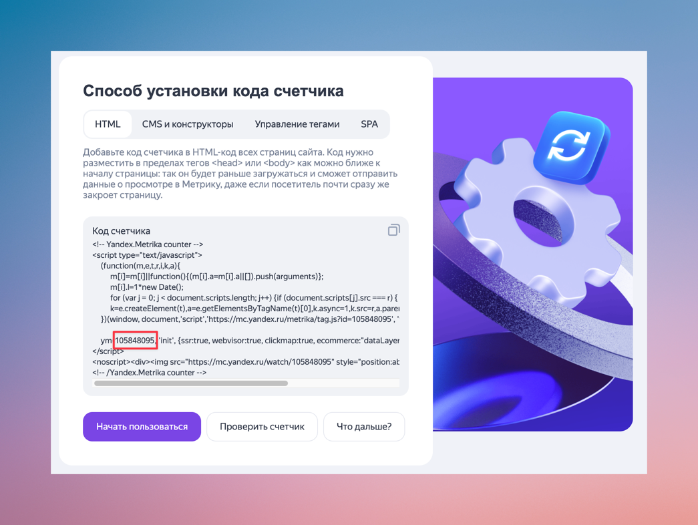
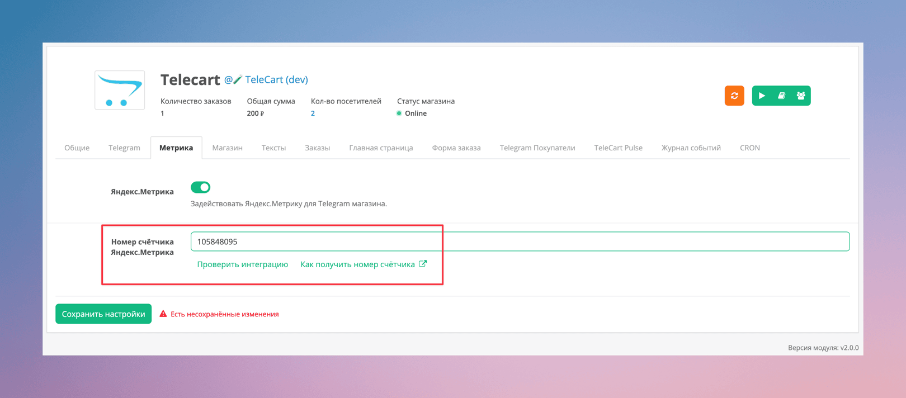

Особое внимание в TeleCart уделено сбору метрик и аналитике пользовательского поведения. Модуль интегрирован с **Яндекс.Метрикой**. 
Для корректной работы метрики необходимо правильно настроить TeleCart и Яндекс.Метрику.

Все события Яндекс.Метрики (включая хиты и цели) привязаны к уникальному `tg_id` — **идентификатору текущего пользователя Telegram**.
`tg_id` позволяет в отчетах анализировать действия одного пользователя, даже если он заходит в магазин с разных устройств.

!!! note

    В соответствии с законом о персональных данных (ФЗ-152, GDPR) и правилами Яндекс.Метрики, нельзя передавать персональные данные без согласия пользователя.
    Поэтому используется **анонимизированный идентификатор** (`tg_id`), по которому невозможно напрямую идентифицировать пользователя, но который позволяет строить метрики в разрезе одного пользователя.

Помимо `tg_id`, на каждый хит (переход на страницу), TeleCart отправляет следующие данные:

* `language` — код языка покупателя в формате [IETF](https://en.wikipedia.org/wiki/IETF_language_tag).
* `platform` — платформа Telegram, например tdesktop или ios.

## Добавление счетчика Яндекс.Метрики

Добавление нового счетчика выполняется на [этой](https://metrika.yandex.ru/add) странице, где необходимо ввести базовые данные и выбрать определенный набор настроек, чтобы счетчик корректно работал с TeleCart.

{ loading=lazy, width=600 }
/// caption
Форма создания счётчика Яндекс.Метрики
///

1. **Имя счетчика**. Будет отображаться в интерфейсе Яндекс.Метрики.
2. **Адрес сайта**. Укажите адрес вашего интернет-магазина (без `http`, `www` и т.д.). Рекомендуется поставить галочку **«Принимать данные только с указанных адресов»**.
4. **Настройка кода счетчика**. Можно не менять.
5. Необходимо принять условия пользовательского соглашения.
6. Нажать на кнопку и продолжить заполнение формы, всё, что требует Яндекс.Метрика.

После того, как вы получили код счётчика Яндекс.Метрики, необходимо скопировать оттуда его идентификатор, я выделил его красной рамкой на примере ниже.

{ loading=lazy, width=600 }
/// caption
Пример полученного счётчика Яндекс.Метрики
///

Нужно скопировать его и вставить в настройки Telecart (вкладка Аналитика).

{ loading=lazy, width=600 }
/// caption
Форма настройки аналитики в Telecart
///

## Проверка счётчика

Яндекс предлагает возможность проверить интеграцию счётчика на сайт. Перед проверкой, из-за особенностей работы Telegram Mini App магазина, нужно в настройках Telecart включить режим разработчика (вкладка Общие).

{ loading=lazy, width=600 }
/// caption
Опция включения режима разработчика в Telecart
///

Теперь можно перейти на вкладку "Метрика" и нажать на кнопку "Проверить интеграцию" под полем для ввода номера счётчика.
Откроется браузер, где должно отобразиться сообщение об успешной интеграции с Яндекс метрикой.

{ loading=lazy, width=600 }
/// caption
Пример сообщения об успешнйо интеграции Яндекс.Метрики в TeleCart
///

!!! Внимание

    После всех настроек, нужно обязательно выключить режим разработчика. Для работающего Telecart магазина он всегда должен быть выключен.