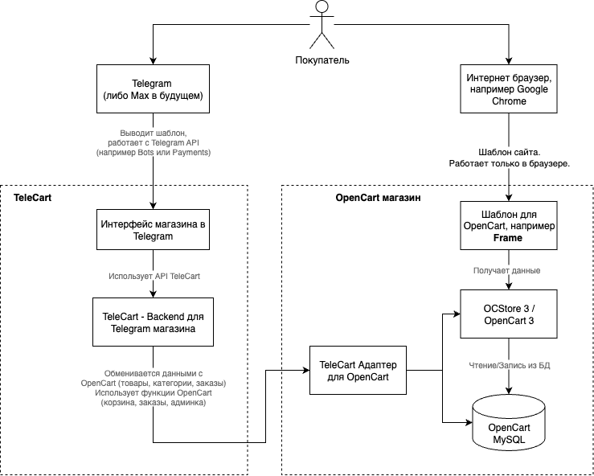

# Архитектура решения

Ниже приведена схема, которая наглядно показывает, как Telegram и модуль TeleCart интегрируются с OpenCart. На схеме видно, что у магазина есть два независимых интерфейса: сайт с вашим шаблоном и магазин внутри Telegram (Mini App). Они используют одну и ту же базу товаров, корзину и заказы в OpenCart, но полностью разделены по отображению и логике работы. Это означает, что любые доработки или изменения в шаблоне сайта не влияют на работу магазина в Telegram. И наоборот.

/// caption
Архитектура TeleCart
///