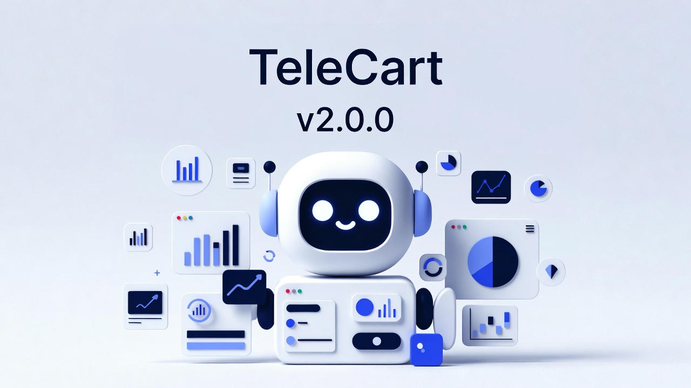

Версия 2.0.0 представляет собой масштабное обновление с новым админ-интерфейсом, системой аналитики, улучшенным пользовательским опытом и расширенными возможностями настройки магазина. Добавлен конструктор форм с визуальным редактором, система управления клиентами Telegram и интеграция с Яндекс.Метрикой для отслеживания конверсий. Производительность улучшена за счет кэширования, а интерфейс мобильного приложения стал более удобным благодаря новым навигационным элементам и жестам.

## 🚀 Добавлено

- Система конфигурации главной страницы через блоки: создание уникальной главной страницы с помощью настраиваемых блоков (слайдеры, карусели товаров). Блоки можно добавлять в любом количестве, менять их порядок и задавать индивидуальные параметры. В будущем список доступных блоков будет расширяться.
- Гибкая система с блоками, позволила реализовать важную функицию: выбор размера изображения для карточек товаров. Это может оказаться критически важным для некоторых направлений бизнеса. Например для магазинов одежды лучше вертикальные изображения, а для магазинов с цветами - квадратные.
- Конструктор форм на базе FormKit: визуальный редактор с drag-and-drop для создания форм заказа без программирования. Доступно более 15 типов полей с гибкой настройкой валидации и внешнего вида. Для продвинутых пользователей предусмотрен режим редактирования кода.
- Интеграция с Яндекс.Метрикой: автоматическая отправка ecommerce-событий (просмотры, корзина, заказы). Это позволяет настраивать цели, отслеживать конверсии и получать детальную аналитику продаж в реальном времени.
- Политика конфиденциальности и согласие на обработку персональных данных: автоматический запрос согласия при первом посещении. Информация сохраняется в базе, а ссылку на политику можно настроить в админ-панели.
- Поддержка купонов и подарочных сертификатов: применение промокодов и сертификатов при оформлении заказа. Система интегрирована со стандартным функционалом OpenCart для автоматического расчета скидок.
- Интеграция с системой телеметрии TeleCart Pulse: инструмент для управления рассылками, рекламными кампаниями и анализа их эффективности.
- Управление клиентами Telegram в админ-панели: просмотр статистики заказов, отправка личных сообщений и отслеживание согласий. Реализована синхронизация с базой покупателей OpenCart.
- Настройка текстов интерфейса через админ-панель: возможность редактировать все тексты приложения без правки кода. Это позволяет легко кастомизировать сообщения под бренд магазина.
- Dock-панель для быстрой навигации: фиксированная панель внизу экрана для доступа к основным разделам. Автоматически скрывается при прокрутке или открытии клавиатуры.
- Navbar с логотипом и названием приложения: отображение брендинга магазина в шапке. Настроить иконку и название можно через административную панель.
- Улучшенный поиск: добавлена sticky-панель и кнопка скрытия клавиатуры. Оптимизировано взаимодействие с Dock-панелью для удобства на мобильных устройствах.
- Просмотр логов: удобный табличный формат с фильтрацией и поиском. Детальную информацию о каждом событии можно просмотреть в отдельном диалоговом окне.
- Отображение аватара пользователя в navbar: визуальный элемент интерфейса. В будущих версиях станет точкой входа в личный кабинет.
- Автоматическое связывание покупателей: система находит и связывает клиентов Telegram с базой OpenCart по email или телефону. Это создает единую историю заказов.
- Отслеживание метаданных заказов: сохранение дополнительной информации и полная синхронизация с OpenCart. Обеспечивает целостность данных между платформами.

## ✨ Улучшено

- Добавлена навигация жестом swipe back — проведите вправо от левого края экрана, чтобы вернуться на предыдущую страницу, как в нативных мобильных приложениях.
- Улучшен интерфейс поиска: sticky-панель, автоматическое скрытие клавиатуры
- Обновлен дизайн главной страницы и общий UI/UX
- Исправлено определение цвета шрифта заголовка в области системной строки (батарея и иконки статусов) на iOS в зависимости от фона — устранена ситуация, при которой текст и фон имели одинаковый цвет.

## ⚠️ Несовместимые изменения

- Настройки мигрированы в новую структуру через систему миграций, старые ключи настроек удаляются автоматически

## 🔧 Технические изменения

- Система миграций базы данных для обновления структуры
- Кэширование блоков главной страницы и базы данных для повышения производительности
- Логирование на базе PSR-3 и Monolog
- Исправления backend и frontend кода, покрытие тестами, исправление ошибок статического анализатора.
