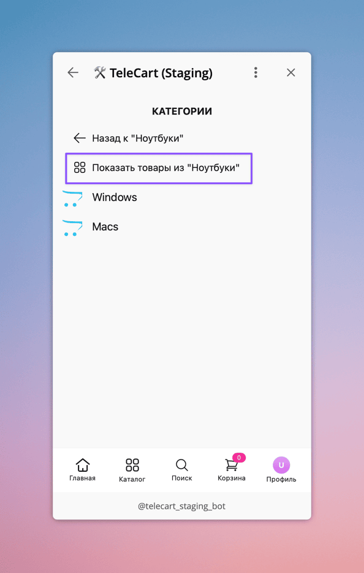

## Добавлено

* Добавлена настройка, позволяющая управлять отображением пункта "Показать товары из {категория}" в Каталоге в TeleCart витрине. Этот пункт позволяет просмотреть товары из категории, даже ели в ней есть дочерние категории.
    
    { loading=lazy, width=300 }
    /// caption
    Пример пункта "Показать товары из {категория}" в Каталоге в TeleCart
    ///