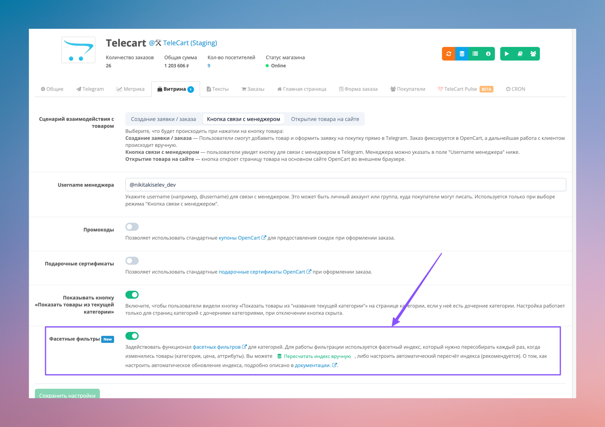

# Фасетные фильтры

{ loading=lazy, width=600 }
/// caption
Демонстрация фасетных фильтров в TeleCart
///

Фасетные фильтры — это фильтры по товарам, которые позволяют гибко отбирать товары по одному или нескольким атрибутам одновременно. При этом пользователь всегда видит только те фильтры и значения, которые действительно доступны после уже применённой фильтрации, а не «пустые» варианты.

Одно из главных преимуществ фасетных фильтров — это высокая скорость работы. Они не пересчитывают товары каждый раз «на лету», а используют заранее подготовленные данные, благодаря чему фильтрация остаётся быстрой даже при большом количестве товаров.

Также фасетные фильтры заметно улучшают пользовательский опыт:
покупателю проще сузить выбор, он не попадает в ситуации, когда фильтр приводит к пустому списку товаров, и быстрее находит нужный вариант. Это особенно важно для магазинов с большим каталогом и множеством характеристик.

В OpenCart есть достаточно модулей с фасетными фильтрами, но ни один из них не подходит для TeleCart. Их код написан не лучшим образом, а логика работы плохо ложится под интерфейсы мобильного телефона и требования быстрого отклика.

В TeleCart реализованы свои фасетные фильтры, сделанные максимально удобными и быстрыми. Их включение не требует сложных настроек — всё работает «из коробки». Единственное, что нужно настроить - это периодическую задачу для обновления фасетного индекса, если товары часто меняются, чтобы фильтры всегда оставались актуальными.

## Включение фасетных фильтров

Для включения фасетных фильтров нужно: 

1. **Активировать** настройку **"Фасетные фильтры"** на вкладке "Витрина".
    
    { loading=lazy, width=300 }
    /// caption
    Включение фасетных фильтров
    ///

2. **Пересчитать фасетный индекс** одним из возможных способов:

    Вручную нажав на кнопку "Пересчитать индекс фасетных фильтров"

    { loading=lazy, width=300 }
    /// caption
    Кнопка ручного пересчёта индекса фасетных фильтров
    ///

    Либо запустив в [терминале CLI](../telecart-cli.md) команду `facet:index`. Способ через терминал удобен, когда товаров и их аттрибутов много и обновление индекса занимает большое кол-во времени. 

## Автоматический пересчёт индекса

Конечно же запускать пересчёт вручную каждый раз, когда товары изменились это неудобно. Поэтому для фасетных фильтров есть отдельная задача в [планировщике задач](./cron.md), которая будет автоматически запускать пересчёт фасетного индекса. Если планировщик задач уже настроен, то нужно просто включить задачу на пересчёт индекса. 
Если планировщик не настроен, то нужно его настроить как описано в [соответствующем разделе документации](./cron.md).

{ loading=lazy, width=700 }
/// caption
Задача в планировщике на пересчёт фасетных индексов
///

Периодичность запуска зависит от того, насколько часто меняются товары на сайте, а так же от количества товаров. Наиболее оптимальным является раз в 3 часа. Но вы можете выставить любой нужный. Единственное от чего следует отталкиваться - это время выполнения задачи. Оно написано под временем последнего запуска. Время выполнения задачи в секундах показывает какое количество времени скрипт затратил на пересчёт индекса конкретно на вашем железе и на вашем количестве товаров. Не следует периодичность запуска делать меньше, чем время выполнения задачи во избежании наложений запуска пересчётов.

## Запуск пересчёта по событию.

В некоторых случаях, запускать пересчёт индекса по рассписанию не удобно либо не оптимально. Например, в случае периодического импорта товаров, когда неизвестно сколько времени и когда завершится импорт, но важно обновить фасетный индекс сразу после окончания процесса.

В этом случае, следует выключить пересчёт индекса в планировщике и перейти на пересчёт через вызов [TeleCart CLI](../telecart-cli.md) команды `facet:index`. Инструкция по запуску TeleCart CLI команд описана в [документации](../telecart-cli.md#запуск-telecart-cli-команд).

Команда для запуска пересчёта:

```
php ./system/library/oc_telegram_shop/cli.php facet:index
```

В конце выполнения команда показывает статистику выполнения.

{ loading=lazy, width=700 }
/// caption
Статистика пересчёта индекса фасетных фильтров
///

Если статистику выводить не нужно, следует добавить параметр `--quiet`.

```
php ./system/library/oc_telegram_shop/cli.php facet:index --quiet
```

Команду `facet:index` нужно вызывать сразу после окончания процесса импорта товаров или другого процесса, который изменяет ваши товары.
