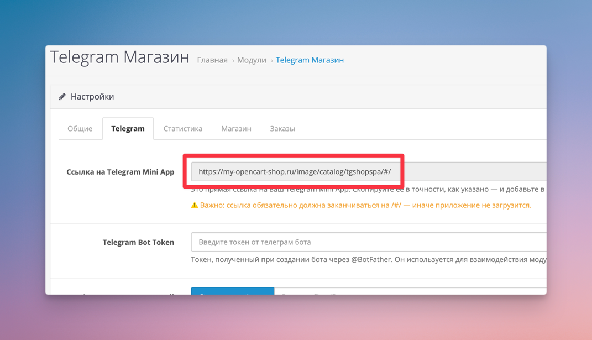
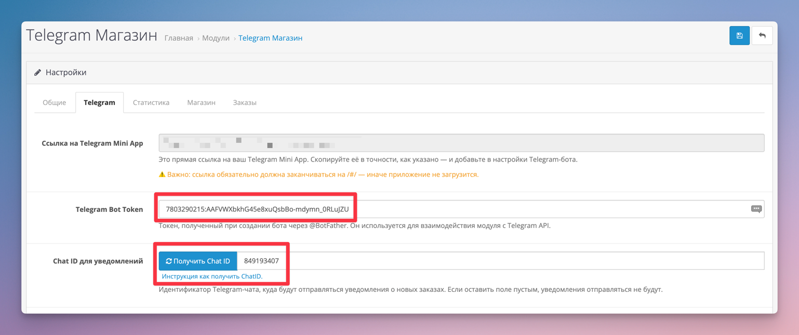

# Быстрый старт

**TeleCart** — это модуль, который позволяет развернуть интернет-магазин в Telegram на основе OpenCart. Максимально
просто, быстро и без сложных настроек.

На этой странице вы узнаете, как буквально за **10 минут** получить готовый интернет-магазин в Telegram.

---

## Предварительные требования

- **OpenCart** версии 3 или **ocStore** версии 3
- **PHP** версии не ниже 7.4
- Архив модуля. Скачать [TeleCart на LiveOpencart](https://liveopencart.ru/opencart-moduli-shablony/moduli/telecart).
- Доступ к админ-панели OpenCart с правами администратора.

---

## Установка модуля

Процесс установки такой же, как у любого другого модуля OpenCart.
Вам не нужно вручную менять файлы — достаточно скачать архив и установить его через панель администратора.

1. Скачайте модуль на [LiveOpencart](https://liveopencart.ru/opencart-moduli-shablony/moduli/telecart).
2. Войдите в админ-панель OpenCart (`https://ваш-сайт/admin`).
3. Откройте раздел _"Расширения -> Установка расширений"_.
4. Загрузите скачанный архив с модулем.
5. Перейдите в раздел _"Расширения -> Расширения"_.
6. В списке **Модули** найдите **"Telegram Магазин"** и нажмите кнопку `[+]`, чтобы установить его.
7. Нажмите на иконку карандаша, чтобы открыть настройки модуля.
8. В приветственном окне нажмите кнопку **"Инициализация"**.
9. После инициализации откроется страница с настройками модуля.

🎇 Установка завершена. Подробную инструкцию со скриншотами и видео смотрите в разделе [Установка](install.md).

---

## Настройка Telegram

Для запуска магазина, потребуется создать Telegram бота и в нём создать Telegram Mini App в котором и будет работать магазин.

### Создание Telegram Bot

1. Откройте телеграм и перейдите в [@BotFather](https://t.me/botfather).
2. Введите команду `/newbot` чтобы инициировать создание бота.
3. Введите название бота, например **"Opencart бот для магазина"** и нажмите Enter.
4. Введите username для бота. Оно должно быть уникальным и заканчиваться на **"bot"**. Например `OpenCartShopBot`.
5. Telegram поздравит с созданием бота, покажет URL по которому открывается чат с ботом (вида _https://t.me/OpenCartShopBot_) и выдаст токен, который нужно сохранить в надёжном месте. Этот токен потребуется для настройки модуля. Пример токена: `7803290215:AAFVWXbkhG45e8xuQsbBo-mdymn_0RLuJZU`.

### Создание Telegram Mini App

1. Ввести в [@BotFather](https://t.me/botfather) команду `/newapp`.
2. Выбрать только что созданного бота с именем `@OpenCartShopBot`.
3. Ввести название приложения, например **"Opencart Магазин"**.
4. Ввести короткое описание для приложения, например "Telegram магазин на базе OpenCart".
5. Загрузить изображение для приложения. Размер изображения 640x360. Вы можете скачать и подставить [эту заглушку](https://dummyimage.com/640x360/000/fff). Позже изображение можно поменять.
6. Далее он предложит загрузить демо GIF, можно пропустить, введя команду `/empty`.
7. Далее он попросит ввести Web App URL. Ссылка на Telegram Mini App находится на странице настроек TeleCart модуля в админ панели OpenCart (вкладка Telegram).
    
8. Далее ввести короткое имя для приложения. Оно будет использоваться в ссылке для прямого открытия магазина. Например, **shop**.
9. В ответ Telegram пришлёт сообщение с прямой ссылкой на Telegram-магазин. Пример ссылки: _https://t.me/OpenCartShopBot/shop_.

Перейдите по этой ссылке и Вы уже увидите работающий магазин в Telegram!

---

## Минимальная настройка модуля

В минимальную настройку модуля входит ввод Telegram Bot Token, который Вы получили в разделе "Создание Telegram Bot", а так же задание Telegram Chat ID, в который будут приходить уведомления о новых заказах администратору магазина.

1. Перейти в настройки модуля TeleCart (раздел _"Расширения -> Расширения"_, далее настройки модуля **"Opencart Магазин"**).
2. В настройках на вкладке "Telegram Bot Token" ввести Telegram Bot Token, который был получен в разделе "Создание Telegram Bot".
3. Написать в Telegram чат с ботом (ссылка на бота была получена в разделе "Создание Telegram Bot", вида _https://t.me/OpenCartShopBot_) кодовое слово `opencart_get_chatid`.
4. Вернуться в настройки модуля и нажать на кнопку "Получить Chat ID". Если всё сделано правильно, в текстовое поле подставится Ваш идентификатор чата с ботом. Пример как выглядит Chat ID: `849193407`.
5. Сохранить настройки модуля.

На этом настройка интеграции модуля TeleCart с Telegram ботом завершена. При успешном заказе, Вы будете получать уведомления в чат с ботом о новых заказах. Покупатель тоже будет получать уведомления, если разрешит получение уведомлений на своей стороне.

---

## Как открыть Telegram-магазин

Открыть магазин можно по ссылке, которую Вы получили при создании Telegram Mini App в разделе "Создание Telegram Mini App.". Пример ссылки: _https://t.me/OpenCartShopBot/shop_. Т.е. она содержит URL адрес самого бота и преффикс `/shop` который отдаёт команду открыть сразу Telegram Mini App.

Далее можно более детально настроить бота, добавив кнопку открытия магазина непосредственно в чате и в описании бота. Что очень удобно. Подробнее про детальную настройку бота можно почитать в разделе [Настройка Telegram](./telegram.md).

---

## Заключение

На этом всё — базовая настройка завершена 🎉.

Теперь Ваш Telegram-магазин готов к работе и уже может принимать заказы, даже без дополнительных настроек.

Я искренне желаю вам больших продаж и надеюсь, что модуль TeleCart поможет вашему интернет-магазину 📈, а Вашим покупателям будет проще и удобнее совершать заказы прямо в Telegram.

Обратите внимание, что в модуле и в Вашем Telegram-боте есть ещё много полезных настроек. Все они описаны на страницах текущей документации. Рекомендую их изучить, чтобы получить полноценный, качественный и удобный магазин.

Помощь и поддержку по модулю Вы можете получить:

* Личные сообщения или комментарии на странице товара в [LiveOpencart](https://liveopencart.ru/opencart-moduli-shablony/moduli/telecart).
* Моя **[официальная Telegram группа](https://t.me/ocstore3)** (подписывайтесь, там я публикую информацию о новых версиях модулей, провожу анонсы нового функционала и собираю пожелания на доработки).
* E-mail: [mail@nikitakiselev.ru](mailto:mail@nikitakiselev.ru)