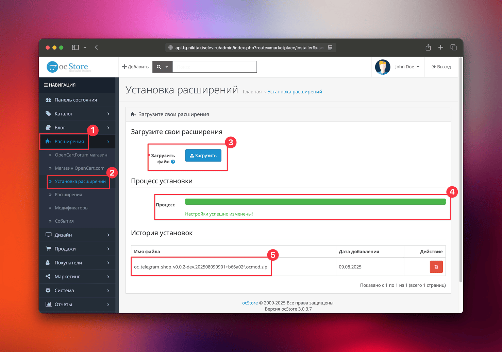
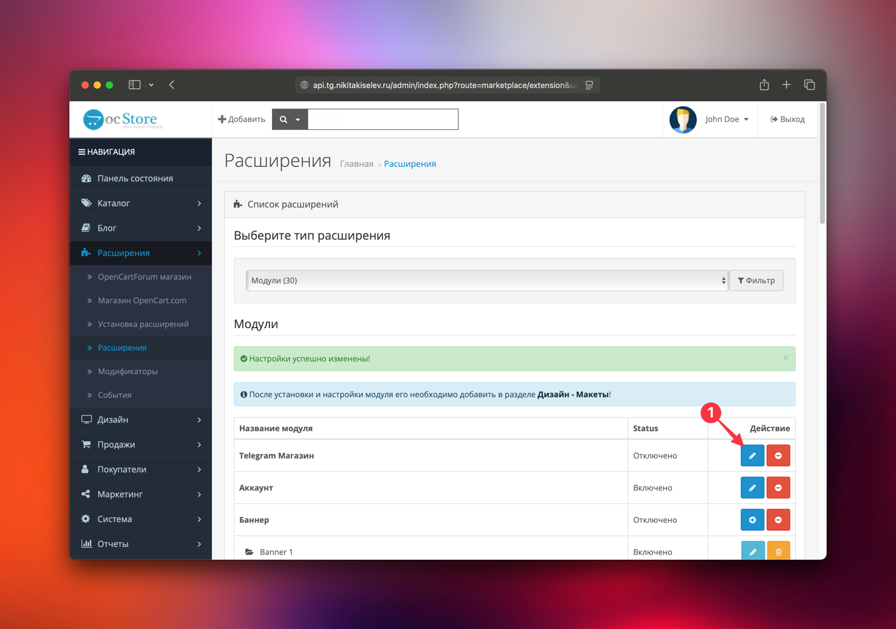

## Системные требования

* OpenCart 3.\* (OcStore 3.\*)
* PHP 7.4+
* PHP расширения: `json`, `pdo`

## Процесс установки модуля

Процесс установки модуля TeleCart стандартный и ничем не отличается от процесса установки других модулей. Не требуется редактировать файлы вручную, заливать по FTP и прочие манипуляции. Ниже я максимально подробно описываю этот процесс.

Рекомендуемый способ установки модуля - через админ панель OpenCart.

### Скачивание модуля

На данный момент есть 2 способа официально получить данный модуль.

1. Скачать модуль [TeleCart на LiveOpencart](https://liveopencart.ru/opencart-moduli-shablony/moduli/telecart).
2. Получить модуль лично от разработчика по email: [kiselev2008@gmail.com](mailto:kiselev2008@gmail.com)

!!! warning "Внимание"

    Все остальные способы получения модуля не официальные и не гарантируют стабильной работы интернет магазина.

Модуль распространяется в zip архиве с названием `oc_telegram_shop_VERSION.ocmod.zip`, где `VERSION` версия модуля.
Версия модуля может быть как "релизной", т.е. стабильной, так и бета версией, которая предназначена больше для тестирования новых функций. Для работающий интернет магазинов рекомендуется использовать только стабильные версии.

**Пример стабильной версии:** `oc_telegram_shop_v0.0.2.ocmod.zip`  
**Пример бета версии:** `oc_telegram_shop_v0.0.2-dev.202508030640+86d0fa9.ocmod.zip`

Такое именование позволяет легко определить распространяемую версию модуля и необходимость его обновления.

### Авторизация в OpenCart
Перейти в административную панель OpenCart (https://ваш-сайт/admin) и авторизоваться.

{ width="300" }
/// caption
Image caption
///

### Установка расширения
1. В боковом меню выбрать пункт **"Расширения -> Установка расширений"**.
2. В поле **"Загрузить файл"** выбрать архив с модулем и дождаться окончания установки.

{ loading=lazy }

### Включение TeleCart

Инициализация модуля требуется для того, чтобы задать начальные настройки модуля, если их нет.

1. В боковом меню выбрать пункт **"Расширения -> Расширения"**.
2. В списке **Модули** найти **"Telegram Магазин"** и нажать кнопку `[+]`, чтобы установить его.

{ loading=lazy }

### Инициализация TeleCart

1. После включения модуля, необходимо в этом списке снова найти **"Telegram Магазин"** и нажать на иконку карандаша, чтобы открыть настройки модуля.

    { loading=lazy }

2. При первой установке модуля, вместо страницы настройки, откроется приветственная страница, с кнопкой "Инициализация". Необходимо нажать на неё.

    { loading=lazy }

3. **Установка и инициализация завершена!** Страница перезагрузится и будет показано сообщение об успешной инициализации модуля.

    { loading=lazy }