# Настройка Telegram

## Введение

Этот раздел подразумевает, что модуль уже установлен и инициализирован. Если нет, то сначала нужно [выполнить установку](install.md).

На текущий момент существует 2 способа создать бота в Telegram. С помощью текстовых команд в чате через [@BotFather](https://t.me/botfather), либо использовать официальный Mini App, который прикреплён к BotFather. Использование Mini App намного удобнее. В этой статье будет описан второй способ.

Минимально необходимые действия, чтобы получить работающий Telegram-магазин:

1. Создание бота
2. Создание Mini App внутри Telegram Bot
3. Выполнить настройку модуля TeleCart через админку OpenCart.

Ниже я максимально подробно и со скриншотами распишу каждый из этих пунктов.

## Создание бота

В Telegram для этого используется специальный сервисный аккаунт — [@BotFather](https://t.me/botfather).
Найдите его через поиск в Telegram, откройте и нажмите Start.

{ width=500, loading=lazy }
 /// caption
Telegram BotFather
///

Для того чтобы открыть **BotFather** как Mini App, нужно нажать на кнопку **Open**, слева от поля ввода сообщения. 

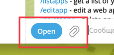{ align=center, loading=lazy }

Откроется Min iApp приложение.

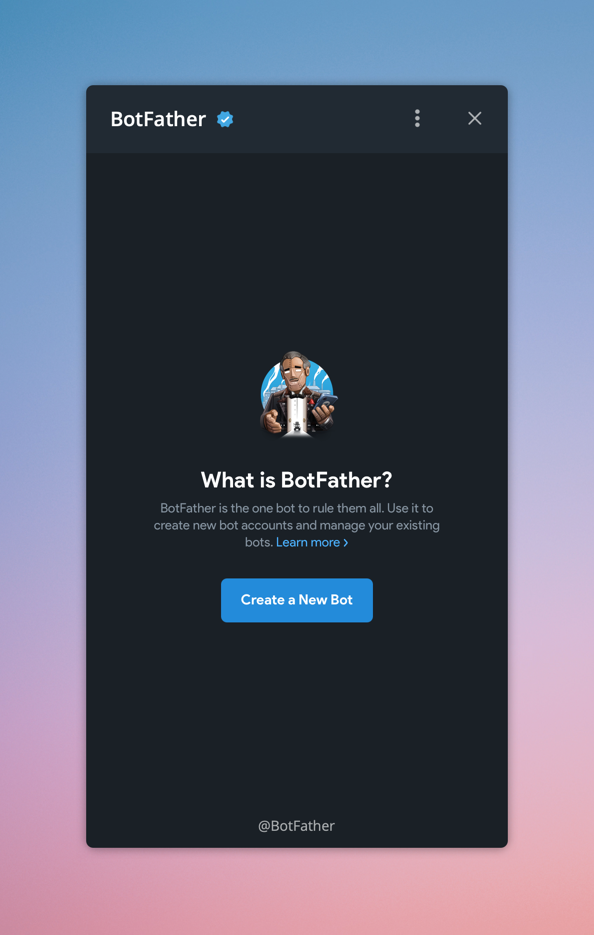{ width=300, loading=lazy }
/// caption
BotFather Telegram Mini App
///

Нажмите на кнопку "Create a New Bot" чтобы создать нового бота. Здесь нужно задать Bot Name и Bot username. Остальные поля по желанию.  

1. **Изображение для бота (аватар)** — будет видно в списке чатов и на рабочем столе мобильного устройства, если пользователь добавит приложение туда. Рекомендуется использовать логотип своего магазина.

    !!! warning "Внимание"

        Ни в коем случае не используйте логотип Telegram на изображении бота. Бот будет удалён, а Ваш аккаунт можеть быть подвержен блокировке. Об этом они явно пишут в условиях: [You must not use the official Telegram logo for your app](https://core.telegram.org/api/terms?utm_source=chatgpt.com#:~:text=You%20must%20not%20use%20the%20official%20Telegram%20logo%20for%20your%20app) 

2. **Bot Name.** Это отображаемое имя и может быть произвольной длины, обычно до ~64 символов (ограничения UI, точной цифры Telegram официально не указывает).
3. **About (About info)** — не обязательное. Максимум 120 символов. Пользователи видят его в профиле бота.
4. **Bot Username** - уникальный username, используемый для ссылок. Длина от 5 до 32 символов, латиница, цифры, подчёркивания, обязательно оканчивается на `bot`.

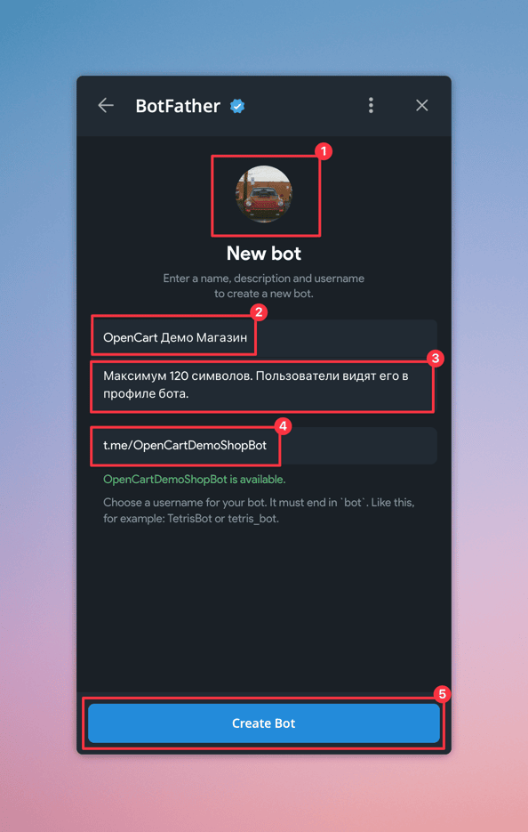{ width=300, loading=lazy }
/// caption
Форма создания нового Telegram Bot
///

Нажмите кнопку "Create Bot" чтобы создать бота.

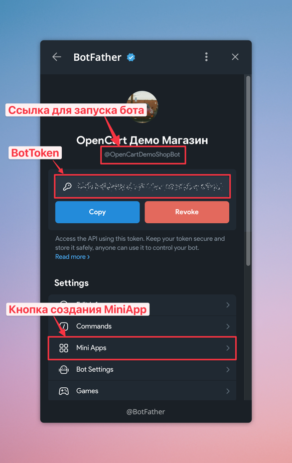{ width=300, loading=lazy }
/// caption
Просмотр созданного Telegram Bot
///

Появится окно только что созданного бота. Из того, на что стоит сразу обратить внимание это

1. `BotToken`, который потребуется на следующих этапах для интеграции TeleCart модуля с Telegram Bot.
2. Кнопка создания Mini Apps.
3. Введённый ранее **Bot username**. Это ссылка для запуска бота. Нажмите на неё, чтобы открыть информацию о боте.

В окне нажмите на кнопку "Отправить сообщение", чтобы запустить бота.

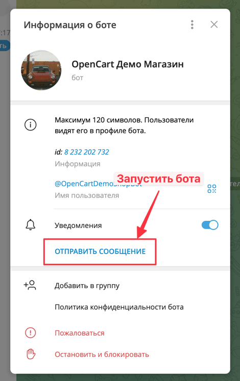{ width=300, loading=lazy }
/// caption
Кнопка отправки сообщения боту.
///

Запустится бот, там нажмите кнопку "Старт", чтобы начать общение с ботом, либо отправьте команду `/start` в чат.

{ width=300, loading=lazy }
/// caption
Отправка команды `/start` боту
///

## Создание Mini App

Для создания Mini App, нужно зайти в [@BotFather](https://t.me/botfather), выбрать своего бота и в разделе Settings нажать на кнопку Mini Apps, чтобы перейти в форму просмотра и создания.

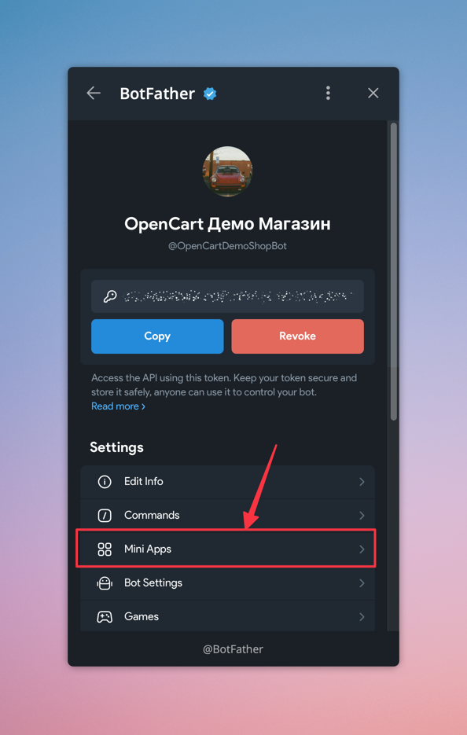{ width=300, loading=lazy }
/// caption
Кнопка просмотра Mini App, привязанного к боту.
///

На данный момент Telegram предлагает 3 способа запуска вашего приложения:

1. **Menu Button** - это кнопка для запуска магазина, которая отображается рядом с полем для ввода сообщения боту.
2. **Main App** - это кнопка для запуска магазина, которая отображается в форме информации о боте.
3. **Direct Link** - ссылка, с помощью которой можно будет напрямую запустить магазин. Эту ссылку удобно пересылать в группы, в личные сообщения.

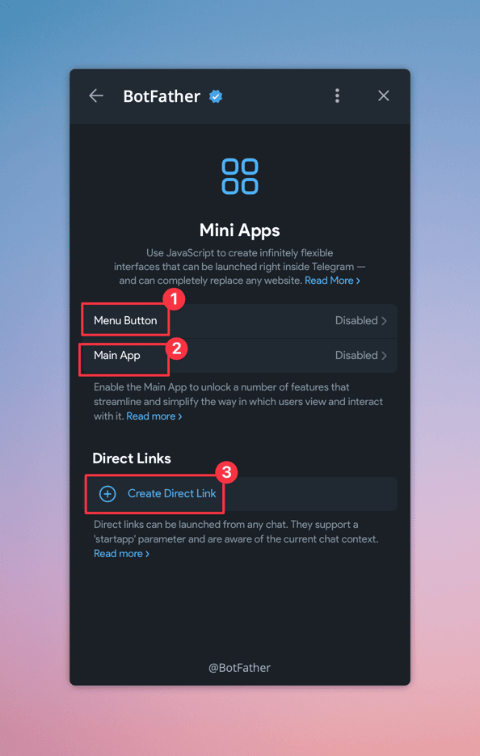{ width=300, loading=lazy }
/// caption
Форма настройки Telegram Mini App
///

Каждый из этих способов требуется ссылку для Telegram Mini App. Эту ссылку можно найти в настройках TeleCart на вкладке Telegram.

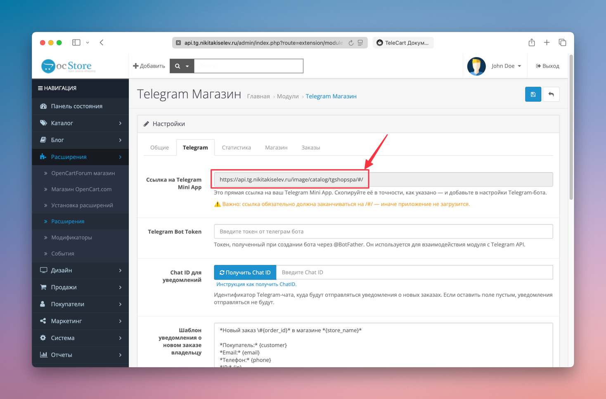{ width=500, loading=lazy }
/// caption
Ссылка для Telegram Mini App
///

### Menu Button 

Это кнопка для запуска магазина, которая отображается рядом с полем для ввода сообщения боту.

Требует 2 значения:

1. **URL** - Ссылка для Telegram Mini App. Берётся из настроек TeleCart.
2. **Title** - Текст на кнопке, любой текст, например "Магазин".

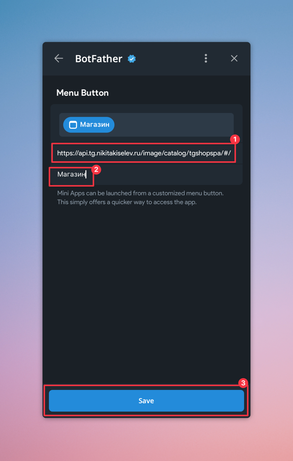{ width=300, loading=lazy }
/// caption
Форма настройки Menu Button
///

Теперь в чате с ботом появилась кнопка "Магазин"

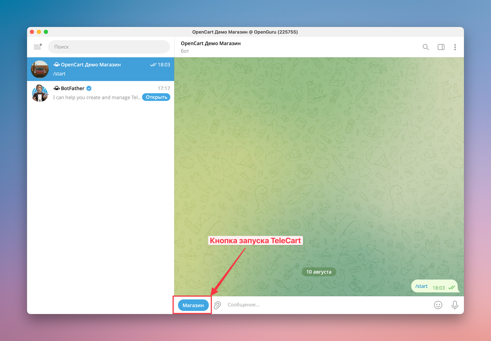{ width=300, loading=lazy }
/// caption
Демонстрация кнопки открытия магазина в чате с ботом
///

!!! note "Информация"
    
    Возможно нужно подождать несколько минут, прежде чем Telegram обновит свои конфигурации и сбросит кеш, прежде чем появится кнопка.

### Main App

Эта кнопка, которая отображается в форме информации о боте.

Здесь требуется задать только ссылку для Telegram Mini App. Берётся из настроек TeleCart.  
Так же желательно выставить полноэкранный режим работы.

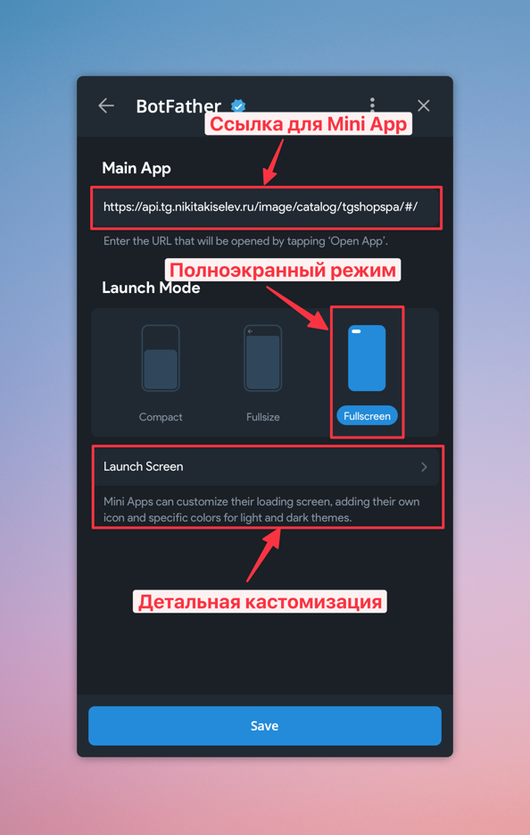{ width=300, loading=lazy }
/// caption
Конфигурация Mini App
///

В пункте "Launch Screen" вы можете более детально кастомизировать экран загрузки магазина, добавив свои иконки и изображения.
Но это уже больше вопрос дизайна.

После нажатия на кнопку "Save", результат работы можно посмотреть, открыл информацию о Вашем боте. 

!!! note "Информация"
    
    Возможно нужно подождать несколько минут, прежде чем Telegram обновит свои конфигурации и сбросит кеш, прежде чем появится кнопка.

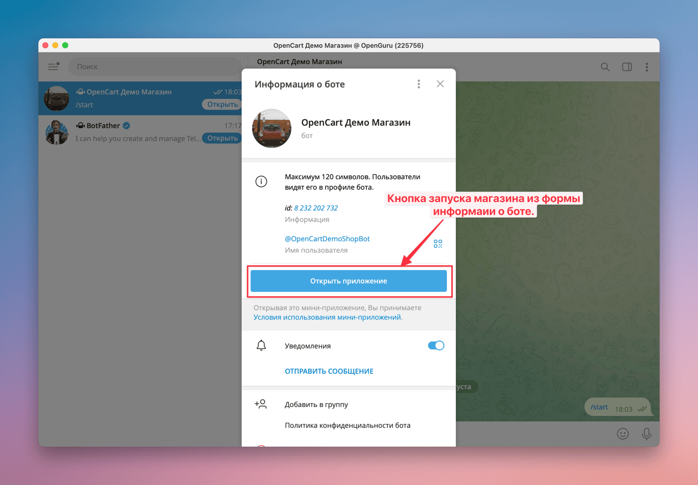{ width=300, loading=lazy }
/// caption
Кнопка запуска магазина из формы информации о боте
///

### Direct Link

После создания Mini App доступны такие возможности как создание прямой https ссылки непосредственно на ваш Telegram магазин.  
Удобство этой ссылки заключается в том, что её можно отправить в любом Telegram сообщение, в e-mail рассылке, указать на сайте, 
либо, например, сгенерировать QR код, распечатать и наклеить на дверь оффлайн магазина, если он есть. Это удобно и выглядит современно, вызывая доверие покупателей.

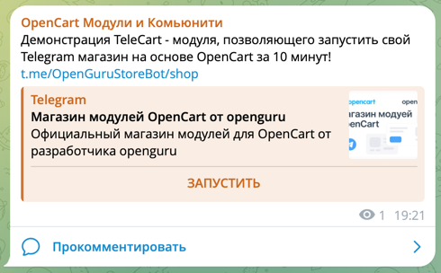
/// caption
Демонстрация Direct Link, отправленной в чате Telegram.
///

{ width=500, loading=lazy }
/// caption
Демонстрация Direct Link, отправленной в приложение Apple Mail.
///

Итак, что нужно сделать, чтобы получить такую ссылку. 
В настройках своего Telegram Bot (Зайти в [@BotFather](https://t.me/BotFather){target="_blank"}, открыть BotFather Mini App,
выбрать своего бота и в разделе Settings нажать на кнопку Mini Apps, чтобы перейти в форму просмотра и создания.).

В разделе "Direct Links" нужно создать новую Direct Link и ввести следующие данные:

* **Enter URL** - ссылка для Telegram Mini App (Эту ссылку можно найти в настройках TeleCart на вкладке Telegram в админке OpenCart).
* **Metadata** - картинка, заголовок и описание. Это будет использоваться при отображении ссылки в чатах и личных сообщениях. Лучше задать, для того, чтобы ссылки вызывали доверие.
* **Link for app** - нужно ввести значение URL, которое будет добавлено к основному URL вашего Telegram бота. Благодаря этому значению, будет открываться не бот, а сразу ваш магазин. Введите например `store`;

{ width=300, loading=lazy }
/// caption
Форма настройки Direct Link
///

После создания, можно будет скопировать ссылку и переслать в группу или в личные сообщения.

{ width=300, loading=lazy }
/// caption
Меню копирования Direct Link
///