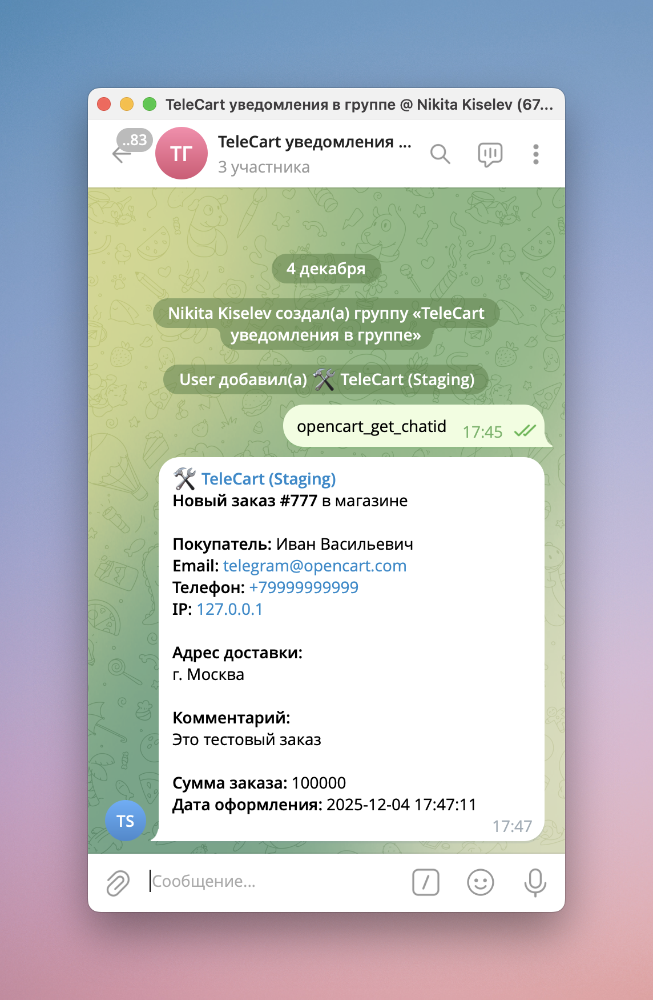
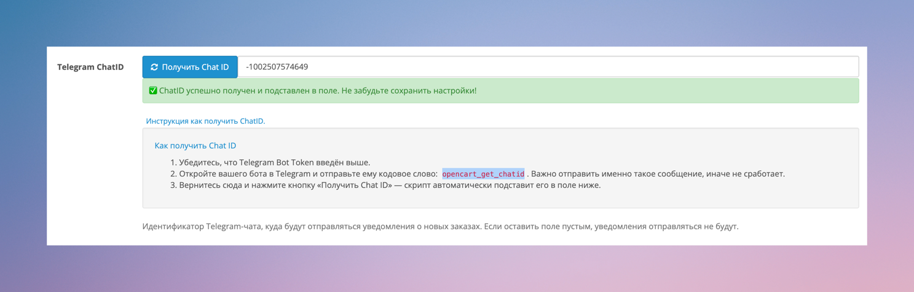

# Отправка уведомлений о заказах в Telegram-группу

{ width=300, loading=lazy }
/// caption
Пример тестового уведомления OpenCart в Telegram группе на нескольких человек.
///

Во многих случаях удобнее получать уведомления сразу в группу, в которой состоят несколько человек: менеджеры, поддержка, владелец магазина и другие ответственные лица.

Это особенно полезно, если:

* над заказами работают несколько менеджеров;
* важно, чтобы уведомление видел сразу весь ответственный состав;
* нужно оперативно реагировать на новые заказы без пересылки сообщений.

Ниже приведена пошаговая инструкция по настройке.

## Шаг 1. Добавьте бота в нужную группу

Необходимо добавить Telegram-бота TeleCart в ту группу, куда вы хотите получать уведомления.
Сделать это может администратор группы или участник с такими правами.

## Шаг 2. Получите идентификатор Telegram-группы

Для отправки уведомлений TeleCart использует `chat_id` — уникальный идентификатор чата или группы в Telegram. В Telegram идентификаторы групп - отрицательные числа, вида `-1002507574649`.

Чтобы получить chat_id группы:

1. Заранее перейдите в настройки Telegram-модуля TeleCart в админ-панели OpenCart.
2. Отправьте специальное слово `opencart_get_chatid` в свою Telegram-группу.
3. В настройках TeleCart нажмите кнопку "Получить Chat ID".

{ width=400, loading=lazy }
/// caption
Получение ID в автоматическом режиме.
///

Если всё сделано правильно, в поле идентификатора чата автоматически подставится число с минусом в начале — это признак того, что Telegram вернул идентификатор группы (в отличие от личных чатов).

## Возможные задержки

Иногда Telegram отвечает с небольшой задержкой.
Если после первого нажатия кнопки chat_id не появился — подождите пару секунд и нажмите «Получить чат-айди» ещё раз.

Это нормальное поведение и не является ошибкой модуля.