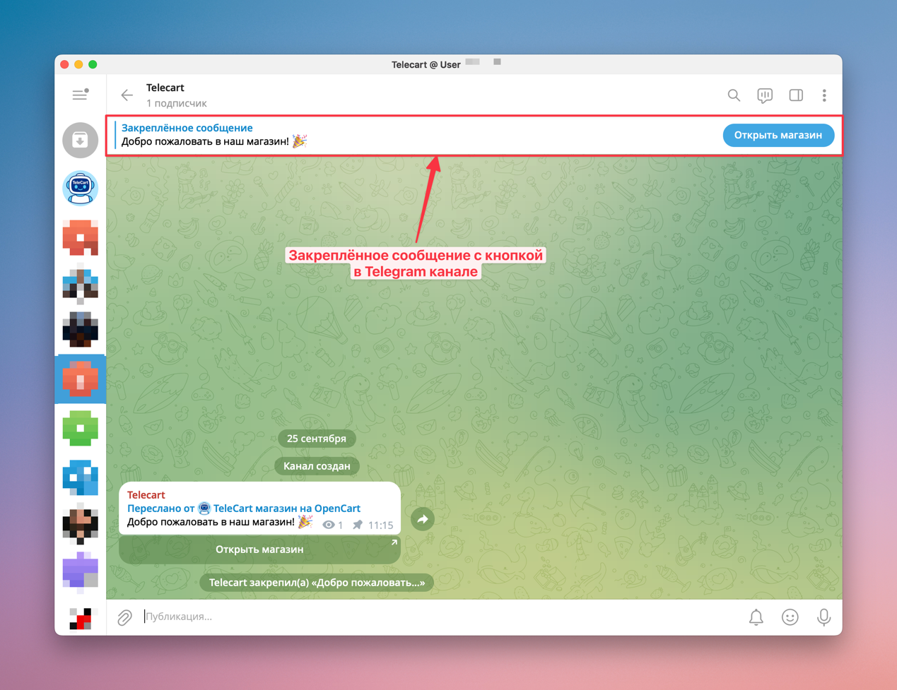
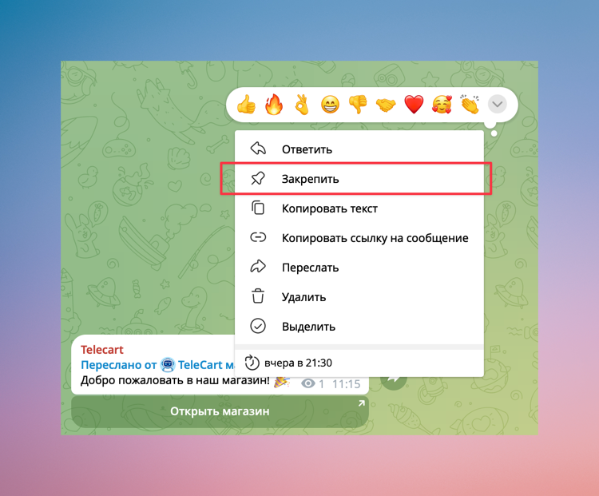

{ width=500, loading=lazy }
/// caption
Демонстрация сообщения с кнопкой открытия Telecart магазина в Telegram группе
///

## Введение

Как известно, у Telegram-бота есть несколько удобных способов открыть магазин или мини-приложение:

* Можно добавить кнопку рядом с полем ввода сообщения ([Menu Button](telegram.md#menu-button)).  
* Разместить ссылку в описании бота ([Main App](telegram.md#main-app)).  
* Показать кнопку прямо в списке чатов ([Direct Link](telegram.md#direct-link)).  

Подробнее про это описано в разделе [Создание Mini App](telegram.md#создание-mini-app).

Однако специфика телеграм-магазина такова, что большинству владельцев хочется делиться ссылкой не в отдельном Telegram боте, а именно 
в уже существующей группе, где уже собраны подписчики и потенциальные покупатели. 

Возникает логичный вопрос: как сделать так, чтобы ссылка на магазин всегда была под рукой у пользователей 
и не терялась в потоке сообщений?

Вариантов на самом деле не так много. В этой статье я расскажу о наиболее удобном, на мой взгляд, способе: 
**закрепить ссылку на магазин в виде сообщения с кнопкой**. 
Такое сообщение будет всегда закреплено вверху канала или группы, 
и каждый посетитель сможет открыть магазин в один клик.

## Как создать сообщение с кнопкой на Windows

Обычными средствами Telegram создать сообщение с кнопкой невозможно — в клиенте такой функции просто нет.  
Но это становится возможным, если сообщение формирует [Telegram-бот](https://core.telegram.org/bots){target=_blank}.

С помощью [Telegram Bot API](https://core.telegram.org/bots/api#sendmessage){target=_blank} можно легко 
собрать «продвинутое» сообщение: задать любой текст и прикрепить к нему одну или несколько кнопок. 
После этого бот сможет отправить такое сообщение в любой чат, к которому у него есть доступ.
Далее администратор группы может закрепить это сообщение и его увидят все подписчики, даже получив уведомление.

В итоге, всё что остаётся сделать - это отправить корректный HTTP запрос в Telegram Bot API. Для этого я написал [простой скрипт](https://gist.github.com/nikitakiselev/2c905396f190a511f1e2aa2c8f2a70c0),
который в интерактивном режиме позволяет сконфигурировать и отправить сообщение в Telegram.

1. Скачайте архив со скриптом ([скачать](https://gist.github.com/nikitakiselev/2c905396f190a511f1e2aa2c8f2a70c0/archive/9c21f299b0d66538531e9dce7f0e0033dd11c519.zip)).
2. Разорхивируйте, нажмите правой кнопкой мыши, в контекстном меню выберите "Выполнить с помощью PowerShell".
3. Введите требуемые данные, в конце скрипт отправит ваше сообщение в Telegram чат.

Скрипт запрашивает следующие данные:

* **Telegram Bot Token**. Можно получить через [@BotFather](https://t.me/botfather) либо в в настройках Telecart в админке Opencart (раздел _"Расширения -> Расширения"_, далее настройки модуля "Telecart").
* **Telegram Chat ID**. ID чата в Telegram, куда бот будет отправлять сообщение. Важно чтобы у бота был доступ на отправку сообщения в этот чат. Самое простое решение - взять из настроек Telecart в админке Opencart "Chat ID для уведомлений". Вариант посложнее - добавить бота в нудный Telegram канал, получить его Chat ID.
* **Текст сообщения**. Текст, который будет отображаться в сообщении. Можно использовать HTML разметку.
* **Текст на кнопке**. Под сообщение (и в закреплённом сообщении сверху) будет кнопка. Задайте текст этой кнопки как призыв к действию.
* **Ссылка для кнопки**. Здесь нужно указать прямую ссылку для открытия Telegram магазина. Это Direct Link, а котором я подробно рассказал в разделе [Direct Link](telegram.md#direct-link). Скопируйте её и вставьте в это поле. Добавьте https:// в начало ссылки, если его нет. 

В указанный чат придёт сообщение.

## Как закрепить сообщение в Telegram группе

В предыдущем разделе я рассказал о том, как сгенерировать специальное сообщение с кнопкой. Теперь, это сообщение необходимо переслать в нужную группу в Telegram, где вы хотите вывести её.  

Далее - стандартный функционал Telegram:  

* **На компьютере** нажмите правой кнопкой мыши на сообщение и выберите «Закрепить» из контекстного меню.  
* **На мобильном устройстве** нажмите и удерживайте сообщение, которое хотите закрепить, и в появившемся меню выберите «Закрепить». 

{ width=500, loading=lazy }
/// caption
Пункт в контекстном меню для закрепления сообщения в группе
///

Теперь сообщение с кнопкой будет закреплено вверху вашей группы, подписчики получат уведомление и не потеряют ссылку на ваш магазин.

## Как сгенерировать сообщение Linux, Macos.

Раздел в разработке и будет наполнен по первому требованию покупателей.